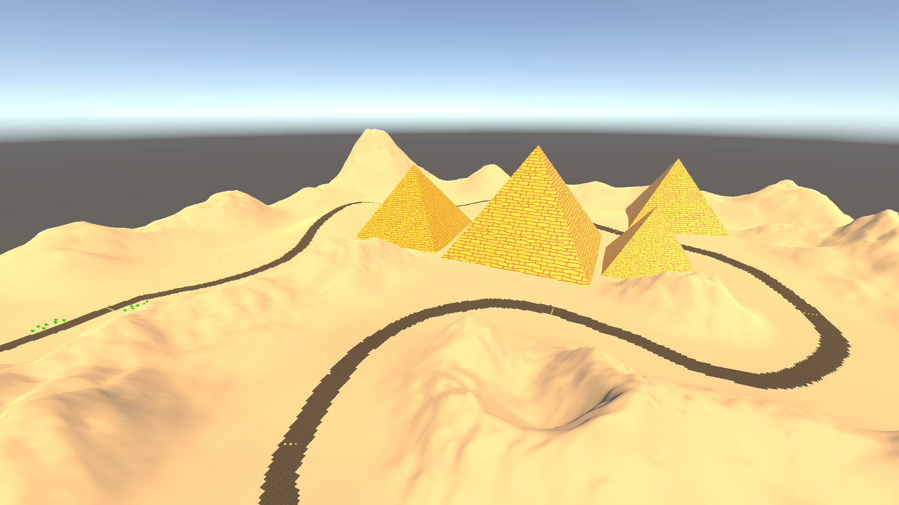
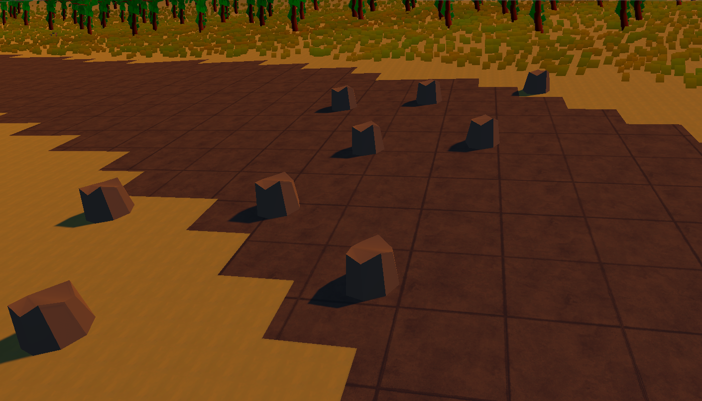

# 2024년도 광주광역시 지방기능경기대회 연습 정리

# 과제 소개

### **장르**

- **2D or 3D 기반 자유 시점 레이싱 게임**

### **스토리 개요**

- **미래의 지구는 인간의 핵실험과 환경오염으로 인해 피폐의 도시와 희망의 도시 두 개의 지역으로 분리되었다. 피폐의 도시를 탈출하고 인간이 행복하게 살아갈 수 있는 희망의 도시로 가기위해 레이싱 대회에서 우승하여 희망의 도시 이동 티켓을 획득하자.**

### **구현 조건 개요**

- **플레이어 차량의 속도 조절과 방향 전환을 구현하여 플레이어가 차량을 운전하여 레이싱 경기에서 우승할 수 있도록 한다.**
- **스테이지는 3개(사막, 산악, 도심)로 이루어져 있으며 각 스테이지의 레이싱 코스와 배경 맵, 방해 오브젝트들을 적절히 배치하여 스테이지를 구현한다.**
- **플레이어의 차량을 업그레이드 할 수 있는 상점 시스템과 레이싱 도중 플레이어에게 이로운 효과를 주는 아이템 시스템을 구현한다.**
- **경쟁 레이서 자동차의 AI와 플레이어를 방해하는 방해 NPC 자동차의 등장패턴, 이동패턴을 구현한다.**
- **게임 종료 후 기록을 남길 수 있도록하는 랭킹(내림차순정렬) 시스템을 구현한다.**

# 과제 구현 개요

### **게임 제목**

- **Speedy Racer**

### **장르**

- **3D TPS 레이싱 게임**

### **사용 엔진**

- **Unity 2022.3.20f1**

### **개발 기간**

- **2024/02 ~ 2024/04**

### **플랫폼**

- **PC**

# 과제 구현

# **레퍼런스**

- **과제를 구현하면서 레퍼런스로 삼았던 게임은 게임로프트 사의 아스팔트 9: 레전드 이다. 과제 내의 방해 요소, 여러 지역으로 구성된 스테이지, 부스터 등의 요구 사항들이 아스팔트 9에 구현되어 있으며, 아스팔트 9의 빠른 속도감과 카메라 움직임이 과제와 적합하다 느껴 레퍼런스로 삼게 되었다.**

# 플레이어

## 플레이어 이동

- **플레이어 이동은 Rigidbody를 사용하여 구현하였다. 차량을 구현할 때 많이 사용되는 Wheel Collider 대신 Rigidbody를 사용한 이유는 Wheel Collider는 값을 조정하는데 상대적으로 시간이 많이 소모되고, 속도감이 Rigidbody에 비해 느리기 때문에 Rigidbody를 사용하였다.**
- **플레이어의 이동을 Rigidbody로 처리했기 때문에 차체가 뒤집히거나, 갑자기 속도가 올라가는 등의 문제로 인해 안정성 측면에서 취약할 수 있다. 때문에 플레이어 이동 구현은 차량 이동의 안정성에 기준을 맞춰 구현하였다.**

### Player 클래스 Move 메서드

```csharp
public void Move()
{
    float z = Input.GetAxis("Vertical") * speed * Time.deltaTime * 350;

    // 차량이 이동중일 때만 회전할 수 있도록 yRot 값에 Input.GetAxis("Vertical")을 곱해준다.
    float yRot = Input.GetAxis("Horizontal") * Input.GetAxis("Vertical") * rotSpeed * Time.deltaTime;

    // 차량이 지면과 닿은 경우에만 이동할 수 있도록 제어 해준다.
    if (Physics.Raycast(transform.position, Vector3.down, 1, 1 << LayerMask.NameToLayer("Ground")))
    {
        rb.AddForce(transform.forward * z, ForceMode.Acceleration);
    }
    transform.Rotate(transform.up, yRot);

    // Vector3.ClampMagnitude 함수를 사용하여 x, z 값만 rb.velocity에 적용하여 차량의 속도를 제한하면서
    // 차량이 중력의 영향을 받을 수 있도록 한다.
    Vector3 vel = Vector3.ClampMagnitude(rb.velocity, maxSpeed + addSpeed - slowSpeed);
    rb.velocity = Vector3.Lerp(rb.velocity, new Vector3(vel.x, rb.velocity.y, vel.z), Time.deltaTime * 10);

    // rb.angularVelocity를 Vector3.zero로 만들어 차량이 예기치 않게 회전하는걸 제어해준다.
    rb.angularVelocity = Vector3.zero;
    
    // y값을 제외한 차량의 각도가 30도를 넘어갈 때 transform.rotation을 Quaternion.identity로 Lerp 시켜주어 차량의 회전을 제어해준다.
    if ((transform.rotation.eulerAngles.x > 30 && transform.rotation.eulerAngles.x < 330) ||
        (transform.rotation.eulerAngles.z > 30 && transform.rotation.eulerAngles.z < 330))
    {
        transform.rotation = Quaternion.Lerp(transform.rotation, Quaternion.identity, Time.deltaTime * 10);
    }
}
```

## **카메라 움직임**

- **카메라 움직임은 아스팔트 9의 카메라 방식을 채택하였다. 일반적인 레이싱 게임의 카메라의 경우 차량이 방향 전환을 하여도 카메라의 중앙에 자동차가 오도록 하는 경우가 많다. 그러나 아스팔트 9의 다른점은 방향 전환 시 카메라가 자동차의 측면에 위치한다. 아스팔트 9의 카메라 방식이 플레이어가 차량을 조종할 때 몰입감을 느끼게하고 차량의 속도감을 높여줄 수 있을 것 같아 레퍼런스로 삼았다.**

**[일반적인 레이싱 게임 카메라(호라이즌 5)](https://www.youtube.com/watch?v=XCV6rNvm2nk&t=106s)**


**[아스팔트 9 카메라](https://www.youtube.com/watch?v=RLp16nsq7q0&t=1429s)**


### **PlayerCamera 클래스**

```csharp
using UnityEngine;

public class PlayerCamera : MonoBehaviour
{
    public Transform lookTarget; // 카메라가 바라볼 위치
    public Transform positionTarget; // 카메라가 따라갈 위치
    public float followSpeed; // 카메라 이동 속도

    private void FixedUpdate()
    {
        // 카메라가 lookTarget을 바라보도록 LookAt 함수 실행한다.
        transform.LookAt(lookTarget.position);
        
        // 카메라의 위치를 Vector3.Lerp를 사용하여 positionTarget.position으로 followSpeed 만큼 이동시킨다.
        transform.position = Vector3.Lerp(transform.position, positionTarget.position, followSpeed * Time.deltaTime);
    }
}
```

- **PlayerCamera 클래스를 통해 월드 스페이스에 존재하는 카메라가 플레이어 자식 오브젝트인 lookTarget, positionTarget을 참조하도록 하여 카메라 이동을 구현하였다.**
- **그러나 PlayerCamera만 구현하면 일반적인 레이싱 게임 카메라와 비슷하기 때문에 Player 클래스에서 방향 전환에 따라 lookTarget과 positionTarget을 이동시켜 주었다.**

### **Player 클래스 lookTarget, positionTarget 위치 설정 코드**

```csharp
lookTarget.localPosition = Vector3.Lerp(lookTarget.localPosition, new Vector3(Input.GetAxis("Horizontal") * 2f, 0.5f, 3), Time.deltaTime * 3);
positionTarget.localPosition = Vector3.Lerp(positionTarget.localPosition, new Vector3(Input.GetAxis("Horizontal") * 4f , 1.75f, -4), Time.deltaTime * 3);
```

- **Player 클래스에서 lookTarget과 positionTarget을 참조하여 Input.GetAxis(”Horizontal”) 에 따라 위치를 조종하여 차량이 방향 전환을 할 때 카메라가 차량의 측면에 오도록 하였다.**

### 구현 결과


---

# 적

## 적 이동 및 물리처리

- **NavMeshAgent 컴포넌트를 사용하여 NavMeshSurface 컴포넌트를 가진 터레인 위를 지나다니도록 하여 적 이동을 구현하였다.**

### Enemy 클래스

```csharp
using UnityEngine;
using UnityEngine.AI;

public class Enemy : MonoBehaviour
{
    public NavMeshAgent agent;
    public Rigidbody rb;
    public Transform target;
    public float speed;

    private void Awake()
    {
        agent = GetComponent<NavMeshAgent>();
        rb = GetComponent<Rigidbody>();
        
        // NavMeshAgent의 SetDestination 함수를 사용해 적 차량의 목적지를 설정해준다.
        agent.SetDestination(target.position);
    }

    private void Update()
    {
        // GameManager 싱글톤을 참조하여 게임이 시작했을 시에만 움직일 수 있도록 설정한다.
        agent.isStopped = !GameManager.instance.isStarted;
        
        // Update마다 agent.speed에 speed를 대입하여 speed 값이 바뀔때마다 적 차량의 속도가 달라지게 한다.
        agent.speed = speed;
        
        // rb.velocity를 Vector3.zero로 Lerp하여 적 차량에 대한 적당한 물리처리를 구현한다.
        rb.velocity = Vector3.Lerp(rb.velocity, Vector3.zero, Time.deltaTime);
    }

    private void OnTriggerEnter(Collider other)
    {
        // Finish 태그를 가진 오브젝트에 닿을 시 GameManager 싱글톤을 참조하여 적 차량의 결승점 도달을 저장한다.
        if (other.CompareTag("Finish"))
        {
            GameManager.instance.isEnemyFinished = true;
        }
    }
}
```

---

# 스테이지

## **코스 제작**

### **사용 패키지 : AI Navigation**

- **코스 제작은 유니티 AI Navigation 패키지의 NavMeshSurface 컴포넌트를 사용하였다.**
- **도로로 사용할 터레인과 지형으로 사용할 터레인을 나눠 도로 터레인만 NavMeshSurface 컴포넌트를 사용하여 적 차량이 도로에서만 움직일 수 있도록 제한하였다.**

## **맵 디자인**

### **사용 패키지 : ProBuilder**

- **각 스테이지의 맵을 디자인 하기위해 유니티 ProBuilder 패키지를 사용하였다.**
- **각 스테이지에 맞는 방해요소와 배경 오브젝트 등을 유니티 BroBuilder 패키지를 사용하여 제작하였다.**

**스테이지 1 사막 지형 배경 피라미드**



**스테이지 2 산악 지형 방해요소 바위**



## **방해 요소**

- **지방대회에서 기본적으로 제공되는 에셋과 ProBuilder 패키지를 사용하여 방해 요소를 구현하였다.**
- **같이 지방대회 과제를 연습하던 친구들이 구현한 방해 요소를 참고해보니 대부분 정적으로 방해 요소를 처리한 부분이 보였다. 방해 요소가 정적이다보니 차량이 부딪혔을 때 차량이 멈춰버려 게임의 속도감이 줄어드는 느낌을 받았다. 이러한 부분과 아스팔트 9에서 도로 중간에 배치된 동적 오브젝트들을 참고하여 방해 요소를 동적으로 구현하였다.**

**[아스팔트 9 도로 중간에 배치된 오브젝트들](https://www.youtube.com/watch?v=RLp16nsq7q0&t=1675s)**


### 구현 결과


---

# 추가기능

# 플레이어 차량 색상 변경

- **메뉴 화면에서 플레이어 차량의 색상을 변경하는 기능을 추가하였다.**

## **트러블 슈팅**

- **Player 클래스에서 플레이어 차량의 MeshRenderer 컴포넌트를 참조하여 Materials 배열을 인덱싱하여 차체의 매터리얼을 메뉴 화면에서 선택한 매터리얼로 변경하려 하였으나 변경이 되지않았다.**

### **Player 클래스 차량 색상 변경 코드 (트러블)**

```csharp
public MeshRenderer carRenderer;

private void Awake()
{
    // 플레이어 차량의 MeshRenderer 컴포넌트를 참조하여 차체의 매터리얼을 메뉴에서 선택한 매터리얼로 변경하려 하였으나 변경이 되지않았다.
    carRenderer.materials[2] = MenuManager.carMaterial;
}
```

## **문제 해결**

- **[Renderer.materials 유니티 Documentation](https://docs.unity3d.com/ScriptReference/Renderer-materials.html) 참고하여 문제를 해결하였다. Unity에서 컴포넌트의 배열을 반환할 때 배열의 복사본을 반환하기 때문에 반환받은 배열의 특정 인덱스를 수정하여도 실제 컴포넌트의 배열이 변경되지 않았기 때문에 일어난 문제였다. 그래서 플레이어 차량의 MeshRenderer 컴포넌트의 Materials 배열을 복사한 뒤 차체의 매터리얼을 변경하고 다시 Materials 배열에 대입하여 해당 문제를 해결하였다.**

### Player 클래스 차량 색상 변경 코드 (해결)

```csharp
public MeshRenderer carRenderer;

private void Awake()
{
    // 플레이어 차량의 MeshRenderer 컴포넌트의 Materials 배열을 복사한 뒤 차체의 매터리얼을 담당하는 2번째 매터리얼을 변경하고, 변경한 배열을 다시 Materials 배열에 대입하여 문제를 해결하였다.
    Material[] m = carRenderer.materials;
    m[2] = MenuManager.carMaterial;
    carRenderer.materials = m;
}
```

---

# 시연 영상

[](https://youtu.be/_7xLaGyhKYc)


https://www.youtube.com/watch?v=_7xLaGyhKYc